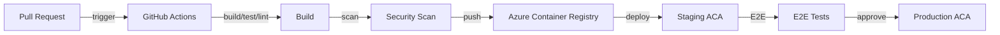

# CI/CD

## Selection: GitHub Actions + Azure Container Registry + Azure Container Apps + Azure Deployment Environments

### Evaluation Matrix

| Criterion | GitHub Actions | Azure DevOps Pipelines | GitLab CI | CircleCI |
|---|---|---|---|---|
| Azure integration | Excellent via OIDC | Native | Good | Good |
| Developer ecosystem | Large | Large | Moderate | Moderate |
| Security scanning | Marketplace + external | Marketplace + external | Integrated | Marketplace |
| Cost | Free/Actions minutes | Included with Azure DevOps | Subscription | Subscription |
| Secret-less Azure auth | OIDC federated credentials | Service connections | OIDC | Limited |

### Recommendation

**GitHub Actions** for CI/CD. Use **Azure Container Registry** for images. Deploy to **Azure Container Apps** and **Temporal workers** via federated OIDC credentials.

## Pipeline Stages

```
Build → Lint → Test → Security Scan → Build Image → Push ACR → Deploy Staging → E2E Tests → Deploy Production
```

## Build and Test

- pnpm install
- TypeScript compile
- ESLint/Prettier
- Unit tests (Jest)
- Integration tests (testcontainers / Azurite / ephemeral DB)
- Contract tests (Pact)

## Security Scanning

- Dependency vulnerability scan (Dependabot, npm audit).
- Container image scan (ACR/Defender, Trivy).
- Secret scanning (GitHub secret scanning).
- SAST if applicable.

## Deployment Gates

- Required approvals for staging and production.
- Automated smoke tests.
- Rollback on failure.
- Feature flags for gradual rollout.

## Environments

| Environment | Purpose |
|---|---|
| Local | Developer machine |
| Development | Shared dev, unstable |
| CI | Ephemeral test environment |
| Test | Stable test environment |
| Staging | Pre-production mirror |
| Production | Live |

## GitOps / IaC Integration

- IaC (Bicep) applied via GitHub Actions to Azure.
- Separate pipeline for infrastructure vs application.
- Environment-based variable groups.
- Secret-less deployments via OIDC.

## Rollback

- Rollback container image tag.
- Revert Terraform/Bicep deployment.
- Database roll-forward only; no destructive migrations.

## CI/CD Diagram



## Proposed ADR

See `TAD-017 GitHub Actions + Azure Deployment Environments for CI/CD`.
