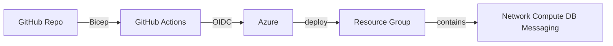

# Infrastructure as Code

## Selection: Bicep (primary) with Terraform for cross-cloud abstractions

### Evaluation Matrix

| Criterion | Bicep | Terraform | Pulumi | ARM Templates |
|---|---|---|---|---|
| Azure-native | Excellent | Good | Moderate | Excellent |
| ARM integration | Direct | Via provider | Via provider | Direct |
| Type safety | Good | Moderate | Excellent (TS) | Limited |
| Module support | Good | Excellent | Good | Moderate |
| Cross-cloud | No | Yes | Yes | No |
| Operational complexity | Low | Moderate | Moderate | High |
| State management | None (Azure handles) | Remote state required | Pulumi service | None |
| CI/CD integration | Excellent | Good | Good | Moderate |

### Recommendation

**Bicep** as the primary IaC language for all Azure resources. It is declarative, type-safe, integrates directly with Azure Resource Manager, and has no state file to manage. Use **Terraform** only where cross-cloud abstractions or specific multi-provider resources are needed.

## IaC Scope

| Resource | IaC Tool |
|---|---|
| Resource groups, VNets, NSGs | Bicep |
| Azure Container Apps environment | Bicep |
| PostgreSQL, Redis, Service Bus | Bicep |
| Storage, Key Vault, App Insights | Bicep |
| API Management, Application Gateway | Bicep |
| ACR, managed identities | Bicep |
| Landing zone subscriptions | Bicep / Terraform |

## Repository Structure

```
/infra
  /modules
    /network
    /compute
    /database
    /messaging
    /security
    /observability
  /environments
    /dev
    /test
    /staging
    /prod
```

## Environment Promotion

- Parameter files per environment.
- Shared modules for common resources.
- Environment-specific overrides.
- Approval gates for prod.

## State and Drift

- Bicep relies on Azure resource state; no separate state file.
- Drift detection via Azure Policy / scheduled what-if deployments.
- Terraform state in remote backend if used.

## Secret Handling

- Key Vault references in Bicep.
- No secrets in IaC files.
- CI/CD uses OIDC to deploy.

## IaC Diagram



## Proposed ADR

See `TAD-015 Bicep as Primary Infrastructure-as-Code`.
