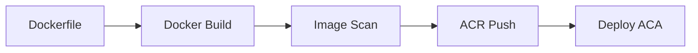

# Containerization

## Container Strategy

All application modules, workers, and AI execution runtimes packaged as **Docker** containers.

## Base Image

- Node.js LTS Alpine or Distroless.
- Multi-stage builds for size and security.
- Pin base image digests.
- No secrets in images.
- Non-root user.

## Container Registry

**Azure Container Registry (ACR)** with:

- Geo-replication if needed.
- Private endpoint.
- Content trust / signing.
- Vulnerability scanning (Defender for Cloud / Trivy).
- Lifecycle policies.

## Image Tagging

```
{repository}:{commit-sha}
{repository}:{semantic-version}
{repository}:latest
```

## Runtime Modules

| Module | Container |
|---|---|
| API / modular monolith | `api` |
| AI Execution Workers | `ai-workers` |
| Background Workers | `bg-workers` |
| Temporal Workers | `temporal-workers` |
| CRM Integration | `crm-adapter` |
| Email Gateway | `email-gateway` |
| Calendar Gateway | `calendar-gateway` |

## Health Checks

- Liveness probe per container.
- Readiness probe for dependencies.
- Startup probe for slow-starting services.

## Resource Limits

- CPU/memory requests and limits.
- Autoscaling targets (CPU, queue depth, custom metrics).
- Cost-aware sizing.

## Graceful Shutdown

- Handle SIGTERM.
- Drain in-flight requests/jobs.
- Complete or checkpoint Temporal activities.

## Containerization Diagram



## Proposed ADR

Containerization decisions are part of `TAD-016 Azure Container Apps as Primary Runtime Platform`.
