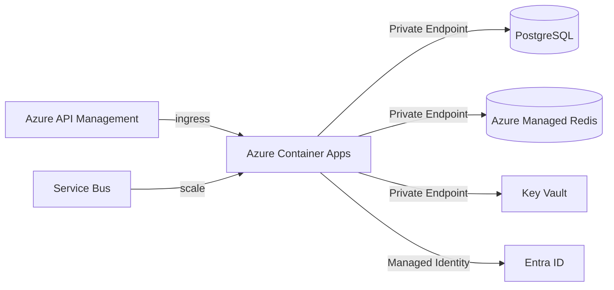

# Runtime Platform

## Selection: Azure Container Apps (primary) with path to Azure Kubernetes Service (AKS)

### Evaluation Matrix

| Criterion | Azure Container Apps | AKS | Azure Functions | AKS + Dapr |
|---|---|---|---|---|
| Operational complexity | Low | High | Low | High |
| Auto-scaling (KEDA) | Built-in | Manual/Addon | Limited | Built-in with Dapr |
| Service-to-service | Native + Dapr | Custom / Service Mesh | N/A | Dapr |
| Cost at low scale | Low | High | Very low | High |
| Multi-container apps | Yes | Yes | No | Yes |
| Managed environment | Yes | Partial | Yes | No |
| Temporal hosting | Yes (workers) | Yes | No | Yes |
| AI workloads | Yes | Yes | Limited | Yes |
| Networking (VNet) | Yes | Yes | Yes | Yes |

### Recommendation

**Azure Container Apps** as the primary runtime platform for all workloads (API, workers, AI execution, Temporal workers, gateways). It provides serverless container hosting, KEDA-based autoscaling, Dapr sidecar support, VNet integration, and lower operational overhead than AKS.

## Workload Mapping

| Workload | Container App Type |
|---|---|
| API / modular monolith | Container App (HTTP ingress) |
| Background workers | Container App Job or scale rules on queue |
| AI execution workers | Container App with queue-based scaling |
| Temporal workers | Container App candidate (pending Phase 07 validation) |
| Integration gateways | Container App |

**Note:** Temporal worker hosting on Azure Container Apps is a candidate only. Phase 07 must validate the full Temporal-on-Azure topology (frontend, history, matching, persistence, visibility, HA, networking) before committing to ACA over AKS.

## Scaling Rules

- HTTP scaling on concurrent requests.
- Queue-based scaling on Service Bus queue depth.
- CPU/memory-based scaling.
- Custom metrics via Azure Monitor.

## Networking

- Container Apps Environment in VNet subnet.
- Private Endpoints for PostgreSQL, Redis, Service Bus, Blob, Key Vault.
- Ingress restricted to API Management / Front Door.

## Path to AKS

- Move to AKS if custom networking, specialized compute, or massive scale requires it.
- Keep workloads portable via containers and Bicep.
- Document AKS migration path.

## Runtime Platform Diagram

## Proposed ADR

See `TAD-016 Azure Container Apps as Primary Runtime Platform`.
