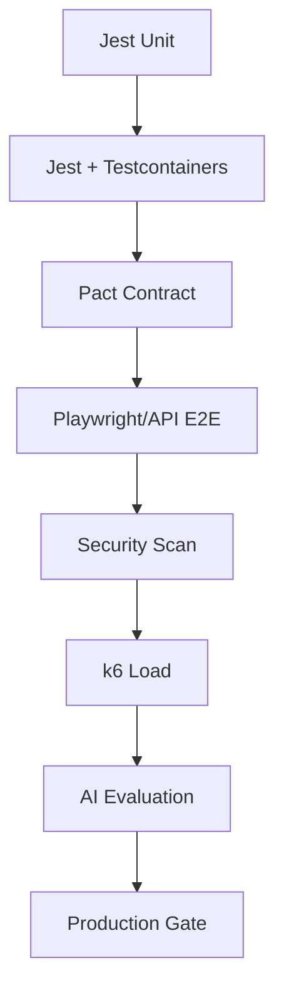

# Testing Technology

## Testing Pyramid

| Layer | Tool | Scope |
|---|---|---|
| Unit tests | Jest | Functions, domain logic, policies |
| Integration tests | Jest + testcontainers / Azurite | Repositories, adapters, DB |
| Contract tests | Pact | API and event contracts |
| E2E tests | Playwright | Critical user flows |
| Workflow tests | Temporal SDK test environment | Workflow logic |
| AI evaluation tests | Custom harness + golden datasets | Model/agent quality |
| Load tests | k6 / Artillery | API throughput |
| Security tests | OWASP ZAP / Burp Suite / custom | Vulnerabilities, prompt injection |
| Chaos tests | Azure Chaos Studio / Gremlin | Resilience |

## Unit Testing

- Jest with TypeScript.
- Domain logic tested without infrastructure.
- Policy engine tests with many scenarios.
- Snapshot tests avoided for behavioral specs.

## Integration Testing

- Testcontainers for PostgreSQL, Redis.
- Azurite for Blob Storage emulation.
- Service Bus emulator or ephemeral namespace.
- NestJS testing utilities.

## Contract Testing

- Pact for consumer-driven contracts.
- AsyncAPI contract tests for events.
- CI enforces contract compatibility.

## E2E Testing

- Playwright for web UI.
- API E2E against staging.
- Test tenant isolation scenarios.

## AI Evaluation Testing

- Golden datasets per capability.
- Deterministic regression tests.
- Hallucination detection tests.
- Safety/adversarial tests.
- Cost/latency benchmarks.

## Security Testing

- Dependency scanning.
- SAST.
- Container scanning.
- DAST against staging.
- Prompt injection and tool abuse test suites.
- Cross-tenant leakage tests.

## Test Environments

- CI runs fast unit/integration tests.
- Test environment runs E2E and contract tests.
- Staging runs full suite before production.

## Testing Diagram

