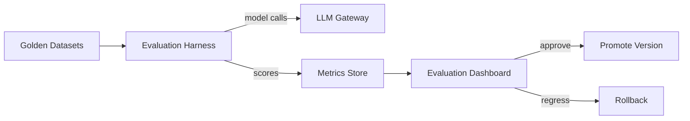

# AI Evaluation Infrastructure

## Purpose

Provide the tooling and data infrastructure to evaluate models, prompts, agents, and workflows before promotion.

## Components

| Component | Technology |
|---|---|
| Evaluation harness | TypeScript (Jest-based or custom) |
| Golden datasets | JSONL/CSV in Blob Storage + PostgreSQL metadata |
| Prompt versions | Git-tracked + registry in PostgreSQL |
| Model runs | Azure OpenAI / OpenAI / Anthropic via LLM Gateway |
| Scoring | Automated metrics + human review UI |
| Regression tests | CI pipeline |
| A/B evaluation | Feature flags + metrics |

## Dataset Management

- Golden datasets versioned alongside agent versions.
- Anonymized and tenant-scoped where needed.
- Test/train split for experiments.
- Data lineage tracked.

## Evaluation Metrics

| Capability | Metrics |
|---|---|
| Research accuracy | Precision/recall of facts, source correctness |
| ICP qualification | Precision/recall, F1 |
| Lead qualification | False positive/negative rate |
| Outreach personalization | Relevance, claim support, tone compliance |
| Conversation handling | Intent accuracy, escalation rate |
| Tool use | Correct tool selection, valid inputs |
| Safety | Injection resistance, policy violations |
| Cost/latency | Per-task tokens and time |

## Human Evaluation

- Spot-check UI for reviewers.
- Inter-annotator agreement tracking.
- Disagreement analysis.
- Calibration sessions.

## Regression Testing

- Run golden datasets on every agent/prompt change.
- Score comparison against baseline.
- Block promotion on regression.
- Track metric trends over time.

## Experiment Tracking

- Experiments versioned.
- Model/prompt/agent variants compared.
- Statistical confidence where sample size permits.
- Rollback triggers.

## AI Evaluation Infrastructure Diagram

