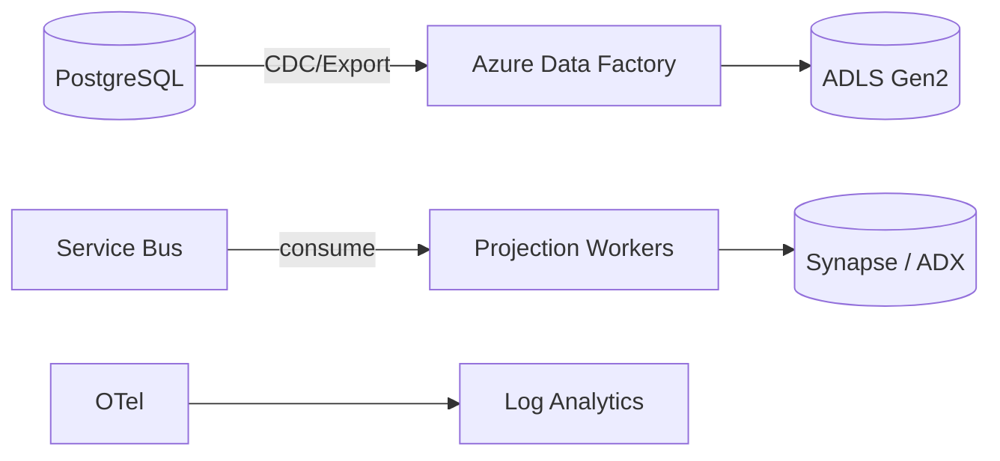

# Data Pipelines

## Purpose

Move and transform operational data into analytics, evaluation, and audit stores without overengineering.

## Data Categories

| Category | Source | Destination |
|---|---|---|
| Operational data | PostgreSQL | Operational store, read replicas |
| Domain events | Service Bus | Event store / analytics projection |
| AI telemetry | OpenTelemetry | Log Analytics / dedicated metrics DB |
| Revenue attribution | Mission/events | Analytics warehouse |
| Evaluation data | Evaluation harness | Blob Storage / PostgreSQL |
| Research data | Research gateway | Blob Storage / vector store |
| Audit data | Audit service | Append-only store / Log Analytics |

## Pipeline Technology

| Use Case | Tool |
|---|---|
| ETL/ELT to analytics | Azure Data Factory or Azure Synapse Pipelines |
| Streaming analytics | Azure Stream Analytics or Azure Functions event consumers |
| Large-scale batch | Azure Synapse / Azure Databricks |
| Event projections | Background workers / materialized views |

## OLTP vs OLAP

- **OLTP**: Azure PostgreSQL for transactions.
- **OLAP**: Azure Synapse Analytics or Azure Data Explorer for analytics.
- **Event store**: Append-only event tables in PostgreSQL or Azure Data Explorer.
- **Data lake**: Azure Data Lake Storage Gen2 (backed by Blob Storage).

## Pipeline Principles

- Minimize operational load.
- Use event-driven projections where possible.
- Tenant ID propagated through all pipelines.
- PII handled per policy.
- Idempotent projections.

## Data Retention

- Operational: per tenant plan.
- Analytics: per retention policy.
- Audit: long-term immutable.
- Evaluation datasets: versioned and archived.

## Data Pipeline Diagram

## Proposed ADR

Data pipeline technology decisions tracked in `TAD-019` Analytics/OLAP decisions.
