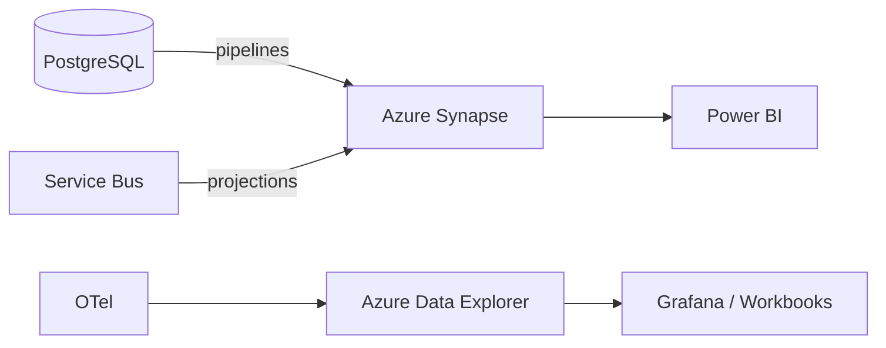

# Analytics

## Purpose

Provide tenant and platform-level analytics for missions, leads, agents, models, campaigns, meetings, opportunities, costs, and ROI.

## Analytics Store

**Azure Synapse Analytics** or **Azure Data Explorer** depending on query patterns:

| Workload | Store |
|---|---|
| Structured BI / reporting | Azure Synapse Analytics |
| Time-series / telemetry / logs | Azure Data Explorer |
| Ad-hoc exploration | Power BI over Synapse/ADX |

## Analytics Domains

| Domain | Metrics |
|---|---|
| Mission analytics | Missions created, completed, failed, conversion rates, cost |
| Lead analytics | Leads discovered, qualified, disqualified, conversion funnel |
| Agent performance | Task success, latency, cost, policy violations, version comparison |
| Model performance | Token usage, latency, fallback rate, evaluation scores |
| Campaign performance | Sent, opened, replied, meeting conversion |
| Meeting conversion | Meetings scheduled, held, no-shows |
| Opportunity conversion | Opportunities created, won, lost, value |
| Revenue attribution | Attributed pipeline/revenue by mission/agent/action |
| AI cost | Cost per tenant, mission, task, model |
| AI ROI | Revenue attributed / AI cost |

## Data Model

Star schema with dimensions:

- Date/Time
- Tenant
- Mission
- Agent / Agent Version
- Model / Provider
- Campaign
- Lead / Company / Contact
- Outcome

## Dashboards

- Power BI embedded for tenant admins.
- Azure Workbooks for operational dashboards.
- Grafana for SRE dashboards.

## Analytics Architecture Diagram

## Proposed ADR

See `TAD-019 Azure Synapse Analytics / Azure Data Explorer for Analytics`.
