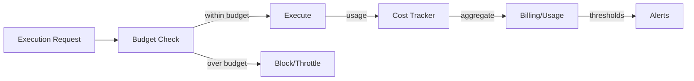

# Cost Architecture

## Purpose

Attribute and control cloud, AI, and integration costs per tenant, mission, agent, task, model, tool, campaign, and lead. Prevent runaway usage.

## Cost Attribution Dimensions

| Dimension | Attribution |
|---|---|
| Tenant | Total monthly AI and infrastructure cost |
| Mission | Cost per revenue mission |
| Agent | Cost per agent execution |
| Task | Cost per task |
| Model | Token and request costs |
| Tool | External provider API costs |
| Campaign | Outreach campaign costs |
| Lead | Cost to qualify and progress a lead |

## Budgets

| Budget Type | Scope | Enforcement |
|---|---|---|
| Tenant monthly AI budget | All AI usage per tenant | Hard cap / alert + throttle |
| Mission budget | AI + provider costs per mission | Hard cap |
| Agent/task budget | Tokens/cost per execution | Hard cap |
| Model budget | Token spend per model | Soft alert |
| Tool budget | External API spend | Alert + throttle |
| Campaign budget | Outreach volume | Alert |

## Cost Tracking

- Token usage per LLM call: input/output tokens, model, provider.
- Cost per call derived from Model Registry.
- Tool cost per call: provider-specific cost.
- Compute cost per container: CPU/memory usage from Azure Metrics.
- Storage, database, and message broker costs per tenant estimated via usage attribution.

## Alerts

| Threshold | Action |
|---|---|
| 50% | Info alert |
| 75% | Warning alert |
| 90% | Critical alert + throttle |
| 100% | Block non-essential AI usage |

## Runaway Detection

- Anomaly detection on token usage and request rates.
- Circuit breaker on excessive LLM/tool usage.
- Automatic mission pause on budget breach.
- Human notification for investigation.

## Cost Governance Flow

## Showback / Chargeback

- Per-tenant cost dashboards.
- Estimated AI ROI (revenue attributed / AI cost).
- Export for finance integration.

## Proposed ADR

Cost architecture decisions embedded in `TAD-010` and operational design.
