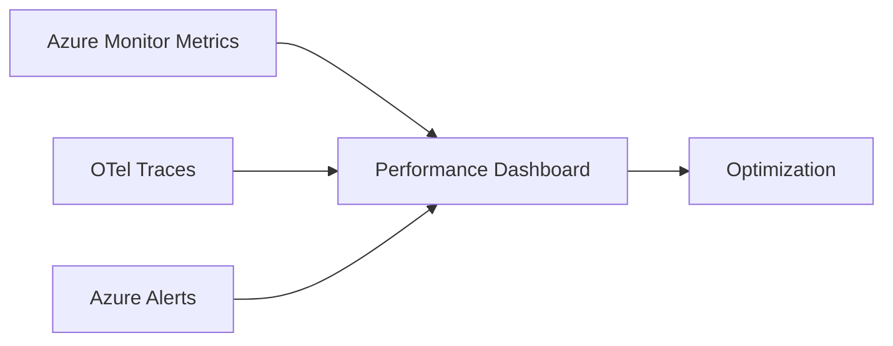

# Performance

## Proposed Targets (unvalidated until measured)

| Metric | Target | Status |
|---|---|---|
| API p50 latency | < 200 ms | PROPOSED |
| API p95 latency | < 800 ms | PROPOSED |
| Simple LLM call p95 | < 5 s | PROPOSED |
| Complex reasoning p95 | < 30 s | PROPOSED |
| Conversation reply p95 | < 3 s | PROPOSED |
| Research task background | < 2 min | PROPOSED |
| Meeting scheduling end-to-end | < 10 s | PROPOSED |
| CRM sync p95 | < 5 s | PROPOSED |
| Event processing latency | < 1 s | PROPOSED |
| Workflow signal latency | < 2 s | PROPOSED |

## Performance Optimization

- Use cheap/fast models for simple tasks; reserve strong models for high-stakes reasoning.
- Cache tenant config, knowledge, and deterministic results in Redis.
- Context compression to reduce token usage and latency.
- Parallel independent tool calls.
- Async processing for non-interactive tasks.
- Read replicas for analytics and list queries.
- Connection pooling.
- KEDA-based autoscaling for workers.
- CDN for static assets.

## Performance Monitoring

- OpenTelemetry traces with latency percentiles.
- Azure Monitor metrics per endpoint and operation.
- AI-specific metrics: token latency, model choice, cost.
- Alerting on SLO breaches.

## Performance Testing

- Load testing with k6/Artillery.
- Soak tests for long-running workflows.
- Profiling in staging.
- Capacity planning based on target tenant count.

## Performance Diagram

