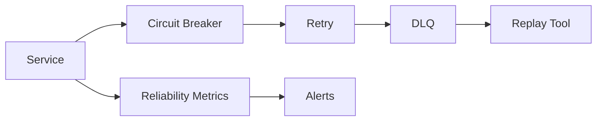

# Reliability

## SLOs (Proposed)

| Service | Availability Target | Latency Target |
|---|---|---|
| Public API | 99.9% | p95 < 800 ms |
| AI Execution | 99.5% | p95 < 30 s |
| Background workers | 99.5% | process within 5 min |
| Workflow engine | 99.9% | durable |
| Event bus | 99.95% | delivery within 1 min |

## SLIs

- Request success rate
- Queue depth and processing lag
- Workflow completion/failure rate
- LLM/tool provider success rate
- Database connection pool health
- Cache hit rate

## Error Budgets

- Monthly error budget per service.
- Budget depletion triggers feature freeze or rollback.
- Alerting at 50%, 75%, 100% error budget.

## Retry Strategy

- Exponential backoff with jitter.
- Max retries per operation type.
- Idempotent operations retry safely.
- Non-idempotent operations require idempotency keys or compensations.

## Circuit Breaker

- Open after threshold failures.
- Half-open probe after cooldown.
- Fallback to secondary provider or degraded mode.

## Bulkheads

- Separate worker pools per capability.
- Separate database connection pools per service.
- Isolated namespaces for critical vs non-critical workloads.

## Backpressure

- Queue-based load leveling.
- Autoscaling based on queue depth and CPU.
- Rate limiting to protect downstream providers.

## DLQ and Recovery

- Service Bus dead-letter queues.
- Temporal workflow retry and compensation.
- Manual replay tooling.

## Reliability Diagram

