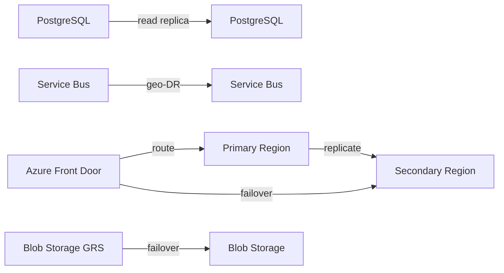

# Disaster Recovery

## RPO / RTO Targets (Proposed)

| System Component | RPO | RTO | Status |
|---|---|---|---|
| Transactional database | 1 hour | 4 hours | PROPOSED |
| Event bus / messaging | 0 (geo-redundant) | 1 hour | PROPOSED |
| Workflow state | 1 hour | 4 hours | PROPOSED |
| Blob storage | 0 (geo-redundant) | 1 hour | PROPOSED |
| Cache | None | Rebuild on failover | PROPOSED |
| AI model provider | N/A | Fallback provider | PROPOSED |

## Backup Strategy

| Component | Backup Method |
|---|---|
| PostgreSQL | Automated backups + PITR; geo-redundant backup |
| Redis | Persistence + RDB snapshots; cache rebuild acceptable |
| Service Bus | Geo-redundancy; messages persisted; DLQ retained |
| Blob Storage | Geo-redundant storage (GRS); lifecycle policy |
| Workflow state | PostgreSQL persistence for Temporal; backup via DB |
| Configuration | IaC in GitHub + Azure App Configuration backups |

## Replication

- PostgreSQL read replicas in secondary region.
- Service Bus Premium geo-disaster recovery.
- Blob Storage geo-redundant storage.
- Azure Container Apps multi-region deployment path documented.

## Failover

- Manual failover for database (with automated path later).
- DNS failover for API via Azure Front Door.
- Event bus failover via Service Bus geo-DR.
- Temporal namespace replication if multi-region.

## Recovery Procedures

- Documented runbooks for each component.
- Regular drills in staging.
- Automated recovery tests where possible.
- Post-incident review process.

## Event Replay

- Event log retained in append-only store.
- Replay capability for analytics projections and audit.
- Idempotent consumers support replay.

## Disaster Recovery Diagram

## Proposed ADR

DR targets are assumptions requiring business validation; see `TAD-004` and operational ADRs.
