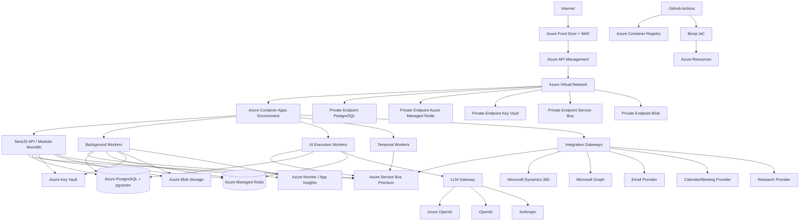

# Production Deployment Topology

## High-Level Topology

## Network Zones

| Zone | Components |
|---|---|
| Public edge | Azure Front Door, WAF, API Management external endpoint |
| Application subnet | Container Apps Environment, private endpoints |
| Data subnet | PostgreSQL, Redis, Service Bus, Blob, Key Vault private endpoints |
| Management subnet | Jump boxes, bastion, monitoring |

## Compute Layout

| Workload | Container App | Scaling |
|---|---|---|
| API | `api` | HTTP concurrency + CPU |
| Background workers | `bg-workers` | Service Bus queue depth |
| AI execution workers | `ai-workers` | Service Bus queue depth + CPU |
| Temporal workers | `temporal-workers` | Service Bus/Temporal task queue depth |
| CRM adapter | `crm-adapter` | HTTP + queue |
| Email gateway | `email-gateway` | Queue |
| Calendar gateway | `calendar-gateway` | Queue |

## Data Layer

- **Azure Database for PostgreSQL Flexible Server**: transactional + vector.
- **Azure Managed Redis**: caching, locks, rate limits, sessions.
- **Azure Service Bus Premium**: commands and domain events.
- **Azure Blob Storage**: object storage and archives.
- **Azure Key Vault**: secrets and certificates.

## External Providers

- Microsoft Dynamics 365 (Dataverse)
- Microsoft Graph
- Azure OpenAI / OpenAI / Anthropic
- Bing Search API / Azure AI Search
- Azure Communication Services Email / SendGrid
- Zoom / Google Calendar / Google Meet

## Observability

- OpenTelemetry Collector sidecar or in-process SDK.
- Application Insights for traces and metrics.
- Log Analytics for logs.
- Azure Monitor Alerts.
- Azure Workbooks / Grafana dashboards.

## Security Controls

- TLS 1.3 everywhere.
- Private endpoints for all data services.
- Managed Identities for service-to-service auth.
- WAF rules on Front Door and Application Gateway.
- NSGs between subnets.
- DDoS Protection Standard.

## Deployment Topology Notes

- Azure Container Apps is the initial compute platform.
- Temporal worker and server placement on ACA is a candidate only; Phase 07 must validate the full Temporal operational topology (frontend, history, matching, persistence, visibility, HA, networking, DR) before committing to ACA.
- AKS path documented for scale or advanced networking needs.
- Multi-region DR topology documented separately.
